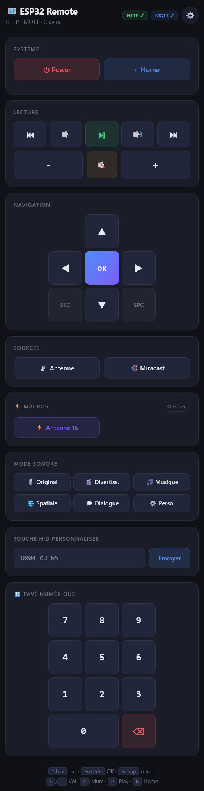
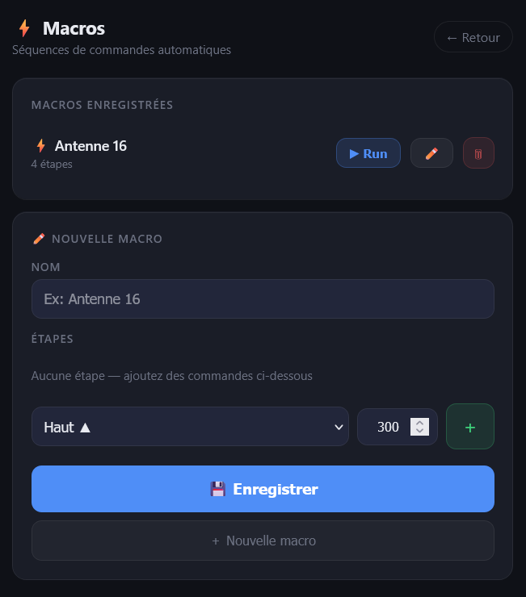
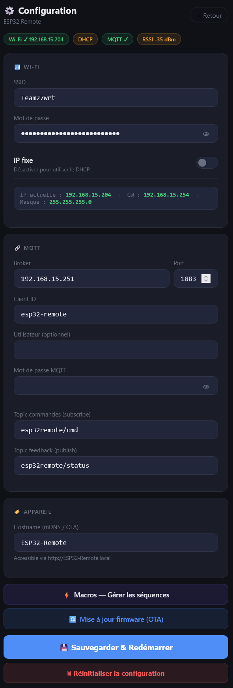
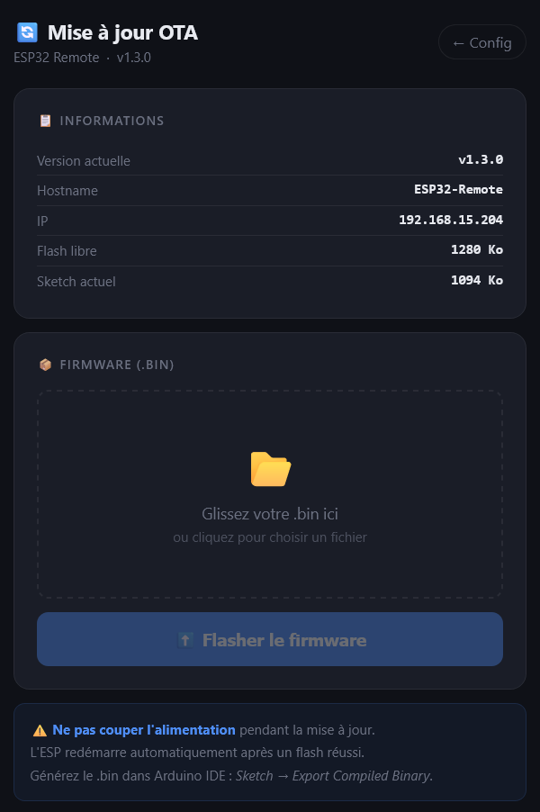

# ESP32 Remote — v1.4.0

ESP32 Remote is a firmware for ESP32-S2/S3 that exposes a local Web interface, MQTT commands, and USB HID functions to control a TV from the network via a local page, Domoticz, or Home Assistant.
Since my Philips TV's API crashes regularly, this firmware emulates a physical HID keyboard plugged into USB.

> ⚠️ **Hardware required**: ESP32-S2 or ESP32-S3 (native USB OTG). A classic ESP32 (without native USB port) does not support `USBHIDKeyboard` and will not compile this sketch.

---

## Screenshots

<table>
  <tr>
    <td align="center"><strong>Main Interface</strong></td>
    <td align="center"><strong>Macros Management</strong></td>
  </tr>
  <tr>
    <td></td>
    <td></td>
  </tr>
  <tr>
    <td align="center"><strong>Configuration</strong></td>
    <td align="center"><strong>OTA Update</strong></td>
  </tr>
  <tr>
    <td></td>
    <td></td>
  </tr>
</table>

---

## Features

- Local web interface with a main page `/`, a config page `/config`, a macros management page `/macros`, and a firmware update page `/update`.
- Sending HID keyboard, media, and system commands via `USBHIDKeyboard`, `USBHIDConsumerControl`, and `USBHIDSystemControl`.
- Controlled via HTTP and MQTT.
- Macro engine: sequences of commands with delays, stored in NVS.
- Sending custom HID codes (`key:<code>`).
- **Free text input** (`text:`) with human-like character-by-character typing emulation.
- **Configurable HID delays** from the web interface to adapt to the responsiveness of any TV or box (Fire TV, etc.).
- **Non-blocking Single-Thread architecture** (queues) optimized for single-core chips (ESP32-S2) stability even under heavy HTML or MQTT requests.
- OTA update via Web interface (drag-and-drop of a `.bin` file) with progress tracking and auto-reboot.
- `ArduinoOTA` support (network update from the Arduino IDE).
- Home Assistant auto-discovery (MQTT) and telemetry publication.
- Fallback Access Point mode if Wi-Fi connection fails.

---

## 💡 Tips & Fire TV / Android TV Compatibility

If you control a TV box (like a **Fire TV**) through your TV's HDMI cable (HDMI-CEC protocol), keyboard letter inputs might be filtered by the TV. 
- Navigation commands (arrows), media (Volume, Play/Pause), and **numbers (0-9)** will pass without any issue via HDMI-CEC.
- The "**Backspace**" key on the web numpad intentionally sends the system media command `CONSUMER_CONTROL_BACK` to ensure native back button functionality on TV boxes.
- For 100% functional alphabetical text input, the ESP32's USB (OTG) cable should ideally be plugged *directly* into the TV box's USB port, rather than the TV's port.

---

## Startup

On boot, the firmware loads its config from NVS using `Preferences`, attempts a Wi-Fi connection in station mode, then initializes the Web server, mDNS, MQTT, and OTA if Wi-Fi is available.
If the Wi-Fi connection fails, the device falls back to AP mode with SSID `ESP32-Remote-Setup`, password `esp32setup`, and a captive portal available at `192.168.4.1`.
The default hostname is `ESP32-Remote`; the interface is accessible at `http://ESP32-Remote.local` when mDNS is working.

---

## Configuration

The `/config` page allows setting:

- **Wi-Fi**: SSID, password, Static IP or DHCP (address, gateway, subnet mask, DNS).
- **MQTT**: broker, port, credentials, Client ID, command and status topics.
- **Device**: hostname (also used for mDNS and ArduinoOTA), interface language, and **fine-tuning of HID delays** (key press duration and pause between keys).

The configuration is saved in NVS, and the ESP32 automatically reboots after saving.
A full factory reset is available via `POST /config/reset`.

---

## Available Commands

The dispatch engine accepts the following commands, triggerable via HTTP or MQTT.

### Navigation
| Command | Action |
|---|---|
| `up` | Up arrow |
| `down` | Down arrow |
| `left` | Left arrow |
| `right` | Right arrow |
| `enter` | Enter / OK |
| `esc` | Back / Escape |
| `space` | Space |

### System
| Command | Action |
|---|---|
| `power` | Power key |
| `home` | Home key |
| `wake` | Wake (Consumer Wake-Up) |

### Volume & Playback
| Command | Action |
|---|---|
| `volup` | Volume + |
| `voldown` | Volume - |
| `mute` | Mute |
| `playpause` | Play / Pause |
| `next` | Next track |
| `previous` | Previous track |
| `volhuit` | Set volume to 8 (from 0) |
| `vol:<n>` | Set volume to `n` (0 – 20) |

### Sources
| Command | Action |
|---|---|
| `antenne` | Select Antenna source |
| `miracast` | Select Miracast source |

### Sound Modes
| Command | Action |
|---|---|
| `son` | Open sound sub-menu |
| `sonoriginal` | Original Mode |
| `sondivertissement`| Entertainment Mode |
| `sonmusique` | Music Mode |
| `sonmusiquespatiale`| Spatial Music Mode |
| `sondialogue` | Dialogue Mode |
| `sonpersonnel` | Personal Mode |

### Numpad
`digit0` to `digit9` — sends the corresponding digit.

### Raw Codes & Text Input
- `key:<code>` — sends the Consumer Control code (decimal or `0x…`).
- `text:<string>` — types the string (keyboard stroke emulation).

### Macros
- `macro:<name>` — runs the macro with this name.

---

## Macros

Macros are stored in NVS in a separate space, with a name and a sequence of steps formatted as `command:delay_ms` separated by commas.
The firmware supports up to **10 macros**. The special step `delay:<ms>` inserts a pause without sending any key.

The `/macros` interface allows creating, modifying, running, and deleting macros. Dedicated routes are:

- `GET /macrolist` — JSON list of macros.
- `POST /macrosave` — saves a macro.
- `POST /macrorun` — runs a macro.
- `POST /macrodelete` — deletes a macro.

On each addition or deletion, the Home Assistant discovery is republished to reflect the current list.

---

## MQTT and Home Assistant

The firmware subscribes to the configured command topic and publishes status updates to the configured status topic.
It also publishes:

- An LWT (Last Will and Testament) state `online` / `offline` (retained).
- Periodic telemetry: Wi-Fi RSSI, uptime, IP address, firmware version (`1.4.0`), number of boots.

Home Assistant entities are generated automatically (MQTT auto-discovery) for command buttons, telemetry sensors, and saved macros.

---

## OTA Update

The `/update` page allows uploading a `.bin` firmware file via drag-and-drop or manual selection, then writes the firmware using `Update.begin` / `Update.write` / `Update.end(true)`.
Upon success, the firmware responds with `OK` and reboots automatically.

The binary can be generated from the Arduino IDE via **Sketch → Export Compiled Binary**.
Network updates via `ArduinoOTA` are also supported in parallel.

---

## Main Routes

| Method | Route | Description |
|---|---|---|
| `GET` | `/` | Main control interface |
| `GET` | `/config` | Read configuration |
| `POST` | `/config` | Save configuration |
| `POST` | `/config/reset` | Factory reset configuration |
| `GET` | `/macros` | Macros management interface |
| `GET` | `/macrolist` | List of macros (JSON) |
| `POST` | `/macrosave` | Save a macro |
| `POST` | `/macrorun` | Run a macro |
| `POST` | `/macrodelete` | Delete a macro |
| `GET` | `/update` | OTA Interface |
| `POST` | `/update` | Firmware upload |
| `GET` | `/mqttstatus` | MQTT connection status (JSON) |
| `POST` | `/sendkey` | Send a custom HID code |
| `POST` | `/sendtext` | Send a free text string |
| `GET` | `/vol` | Precise volume setting (`?val=0`–`20`) |
| `GET/POST` | `/*` (AP mode) | Captive configuration portal |
